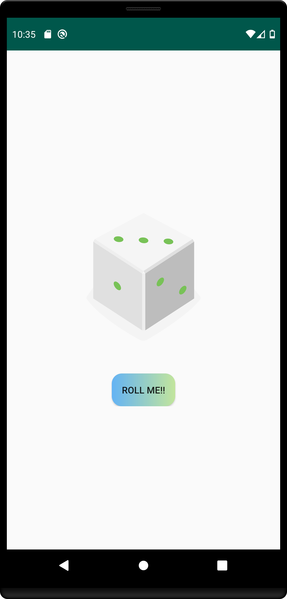

# Dice Roller
Simple android app which uses a Linear Layout with a button and a single imageView. When the button is clicked, it calls a function to change the source of the imageView to a random vector image of a dice. Uses a layout resource file to apply gradient background to button

